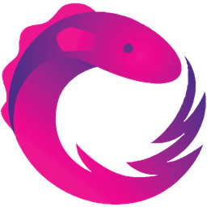

# intro-to-rxjs-talk

This is a combination of examples and links for a talk I've done on an intro to RxJS.

This project also works well alongside my blog post [Getting Started with RxJS](https://rhythmandbinary.com/2020/02/12/getting-started-with-rxjs).

For any code I referenced in my talk, please [review](examples.md).

For my talk slides, please go [here](presentation/talk_slides.pptx).

In addition to the notes here, I recommend you check out the [RxJS docs](https://rxjs.dev/).

## RxJS Posts

I've also written two posts on the [RxJS DEV.TO](https://dev.to/rxjs) site:

- [From Promises to Observables](https://dev.to/rxjs/from-promises-to-observables-4bdk)
- [Common Approaches to Handling Subscriptions](https://dev.to/rxjs/common-approaches-to-handling-subscriptions-1nk7)

## Further Learning

I also highly recommend the following videos for more in depth walkthrough of RxJS:

- [GOTO 2018 - Functional Programming in 40 Minutes - Russ Olsen](https://www.youtube.com/watch?v=0if71HOyVjY)
- [RealTalk JavaScript Episode 31: RxJS Wizardry with Ben Lesh](https://realtalkjavascript.simplecast.com/episodes/39f4a2e2-1fe70e46)
- [Ng-Cruise - RxJS By Example with Ben Lesh](https://www.youtube.com/watch?v=K7AvXUNB2X8)
- [Creating an Observable from Scratch (live-coding session) - Ben Lesh](https://www.youtube.com/watch?v=m40cF91F8_A)

## Credits

RxJS image above was copied from [here](https://rxjs.dev/).

## Contact Info

Follw me on [@AndrewEvans0102](https://www.twitter.com/AndrewEvans0102) and [andrewevans.dev](https://www.andrewevans.dev).
